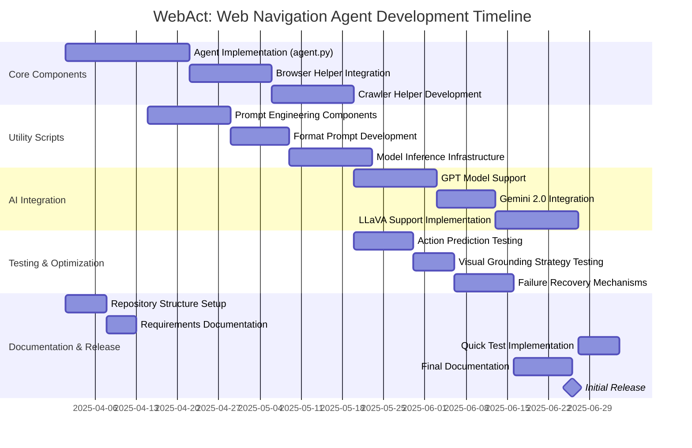

# WebAct: Web Navigation Agent Action tool 

WebAct is a sophisticated framework designed for autonomous web navigation tasks using AI-driven agents. The system combines browser automation with Large language model (LLM) integration like Gemini 2.0, GPT-4o or LLaVA to perform complex web interactions based on natural language instructions, or prompts to be short. This framework is particularly suited for automating multi-step web tasks, crawling, and intelligent interaction with web elements.



## Project Structure

The repository is organized into modular components to support various aspects of web interaction and AI integration:

- **Agent Implementation**:  
  `agent.py` contains the primary `WebActAgent` class that orchestrates the entire navigation process, handling action prediction, execution, and state management. The agent integrates vision and text processing capabilities to interact with web elements intelligently.

- **Utility scripts**:  
  The `data_utils` directory provides prompt engineering components and formatting tools for AI interactions. `demo_utils` contains browser automation handlers, crawler logic, and model inference infrastructure:
  - `browser_helper.py`: Playwright integration for browser control
  - `crawler_helper.py`: Link discovery and navigation logic
  - `format_prompt.py`: Response processing and normalization
  - `inference_engine.py`: Multi-model support (GPT, Gemini, LLaVA)

- **Requirements**:  
  `requirements.txt` specifies the Python dependencies, while `quick_test.py` offers a ready-to-run demonstration of the agent's capabilities using sample tasks.

## How it works


## Key Features

The framework supports multiple interaction modes including visual grounding strategies and text-based element selection. Agents can handle complex workflows through configurable action spaces containing 18 distinct operations ranging from basic clicks to advanced navigation commands. The system implements intelligent failure recovery with features like automatic tab restoration, element visibility checks, and adaptive retry mechanisms.

## Installation

To set up the development environment:

1. Clone the repository and install dependencies:
```bash
git clone https://github.com/red-sat/WebAct.git
cd WebAct
pip install -r requirements.txt
```

2. Install Playwright browsers:
```bash
playwright install
```

3. Configure API keys in your environment:
```bash
export OPENAI_API_KEY="your-api-key"
export GEMINI_API_KEY="your-google-key"
```

For testing purposes, I advise to use gemini, since Google provides the free tier that allows up to 60 requests per minute without incurring any costs.  

## Usage

The agent can be initialized with custom configurations for different use cases:

```python
from webact.agent import WebActAgent

async def run_agent():
    agent = WebActAgent(
        model="gemini-1.5-flash",    # or gemini-2.0-flash-exp
        default_task="Find latest AI research papers",
        default_website="https://arxiv.org",
        grounding_strategy="text_choice_som",
        max_auto_op=100
    )
    await agent.start()
    while not agent.complete_flag:
        prediction = await agent.predict()
        await agent.execute(prediction)
    await agent.stop()
```

## Configuration

The agent supports extensive customization through constructor parameters and TOML configuration files:

- **Browser Settings**: Control viewport size, headless mode, and persistence
- **Agent Behavior**: Adjust action space constraints and failure thresholds
- **Model Parameters**: Configure temperature, rate limits, and vision processing
- **Debug Features**: Enable tracing, video recording, and DOM snapshots

Key operational parameters include:
- `max_auto_op`: Maximum allowed operations per session
- `grounding_strategy`: Element selection methodology (text_choice_som/pixel_2_stage)
- `input_info`: Data sources for decision making (screenshot/accessibility tree)
- `crawler_mode`: Enable automatic link discovery and traversal
